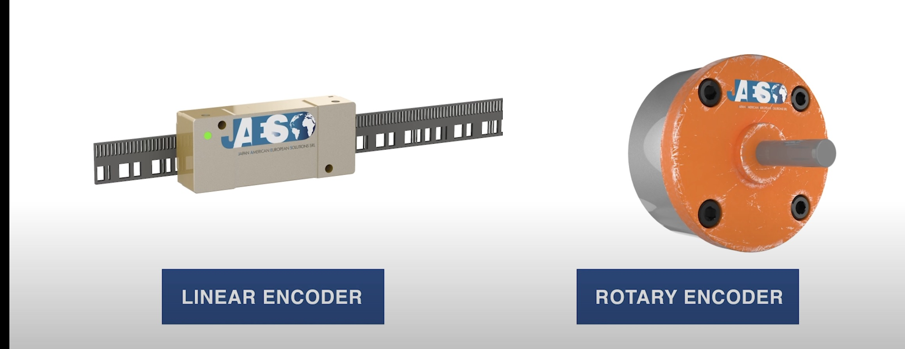

# Length Measurement with Direction (Optical Ruler) 

# Introduction

The positioning of certain engineering systems is required to very great accuracy, notably in the semiconductor industry where wafers must be moved to known positions to **sub-micron precision**. In principle, optics should be able to provide position information to within **a fraction of a wavelength of light**.

It is possible to construct such systems interferometrically. Simplistically, one can conceive of a **Michelson interferometer** with one mirror attached to the moving object and a second acting as a reference; and a distance moved would translate into a **number of fringes** that could be **counted electronically**.

An alternative approach, an **encoder**, works as you yourself would by **reading the marks on a scale or ruler**. In either case the trick is to be able to deduce the **direction** as well as **magnitude** of the movement and for this you might need two interference patterns or scales in parallel.

 Many commercial systems (for instance as used in the Moller-Wedel experiment) use this second sort of method and can do so very accurately over large distances. 

# Aim
To produce an optical system capable of detecting **motions** over **a few cm** and giving **directional** as well as **distance** information. The system must be insensitive to tilts of the moving object, and to **beam divergence** over the operating distance.

Limitations in terms of signal to noise ratio, maximum distance of operation, etc. must be determined.

**What does insensitive to tilt mean?**

# Possible Solutiuon

## Michelson Interferometer 

The structure of the Michelson interferometer is relative simple, consisted of the laser source, a beam splitter ,one mirror attached on the moving object, one reference mirror and the detector.

<text>Figure 1. Basic Structure of Michealson Interferometer</text>

   
### Laser Source

AS for the laser source, considering the **length of coherent**, it is of necessity to use a single mode laser source. The wavelength of the laser source should also be put into consideration due it infect the size of the fringes. Longer wavelength meaning larger spacing between the fringes.

$$d = \frac{\lambda}{2}$$

The heat sink of the laser should also be put into consideration.

The potential laser sources: He-Ne laser source, semiconductor laser source.

### Light Splitter 

The silver-coated light splitter should have a split ratio of 50:50.

### Optical Device Holder
The holder of the optical device should enable the optical have a few degrees of freedom(Yaw, Pitch, Roll, X, Y, Z).

### Camera  

There are few parameters of the camera that we should consider. 

* Frame Fresh Rate
* Resolution
* Shutter Speed
* Wavelength Sensitive
* Bit in Pixel

### Software

One of the most important parts in this project is the fringes recgnition software. 

First of all, is how to deal with image transmitted from the camera. Embedded system or sdk on PC?

The algorithm is not hard for me (XD), this can be easily solved.

## Optical Encoder

We are not sure whether the encoder refered in the introduction is the same as the picture shown below.

<text>Figure 2. Two Types of Optical Encoder</text>

# Literature Review

Fringe counting interferometers can achieve extremely accurate measurements with direct traceability to primary length standards. However, they don’t directly measure distance. Instead, they measure displacement. In order to measure a distance, the displacement between the two end points must be measured, counting fringes continuously without breaking the laser beam, something that can be difficult and time-consuming in a production environment.

It is also possible to use interferometry for absolute distance measurement (ADM). This means that the distance to the measurement mirror can be directly determined without continuously counting fringes between a starting and finishing position. The laser bean can, therefore, be broken and picked up again during a displacement measurement. Not all laser ADM measurements use interferometry. The time-of-flight method mentioned above is one example.

A popular ADM technique for industrial measurements is phase detection of a modulated polarization plane, which is used by Leica in laser trackers. The phase of a reference signal is compared with the phase of a measurement signal. This may be considered as a form of interferometry since modulated waveforms are compared with each other, although these types of ADM are generally not referred to as interferometers. In any case, it overlaps in terms of application and performance.

Phase detection of a modulated polarization plane uses a modulated signal rather than the waveform of the light its-self. This allows the frequency and wavelength to be easily adjusted until the reference signal and measurement signal are in-phase. The frequency $f_{1}$ can be recorded before being increased to the next frequency $f_{2}$ where both signals are in phase. The distance in each case is given by the following equations:

$$
d = \frac{\lambda_{1}}{1}N_{1}
$$

$$
d = \frac{\lambda_{2}}{2}N_{2}
$$

$d$ is the distance being measured.  $\lambda_{1}$ and $\lambda_{2}$ are the wavelengths at each recorded frequency where the signals are in-phase. $N_{1}$ and $N_{2}$  are the corresponding integer numbers of wavelengths over the length d.We can use the fact that the waves were not in phase for any wavelengths between $\lambda_{1}$ and $\lambda_{2}$ to deduce that $N_{2} = N_{1}+1$ . We can also use the fundamental wave equation to substitute the wavelength for the frequency and speed of light, $c$.

$$
d = \frac{c}{2(f_{1}-f_{2})}
$$

ADM measurements allow beam breaks during measurement operations and make measurement in a production environment far more practical.Another highly accurate form of ADM is known as frequency scanning interferometry (FSI). This is a similar technique but rather than adjusting the wavelength of a modulated signal, a tunable laser is used so that the wavelength of the light itself is tuned. FSI was developed by researchers at the University of Oxford to monitor the positions of detectors in the Large Hadron Collider. This required several hundred interferometers arranged in a geodetic grid so that shape changes of the particle tracker could be continuously monitored with micrometer resolution over tens of meters. This measurement system was required to maintain accuracy without any access or maintenance over a 10-year period. A particular challenge was that vibrations change the optical path distance during the laser tuning process. The FSI measurement method that emerged uses a single scanning laser source, fiber channeled to hundreds of individual interferometer lines. The measurements have direct traceability to the fundamental definition of the meter, based on the speed of light, so it needs direct calibration. It is now being adapted into industrial measurement instruments, such as the FSI based optical CMM developed by NPL and the multiline machine monitoring and calibration system developed by Etalon.