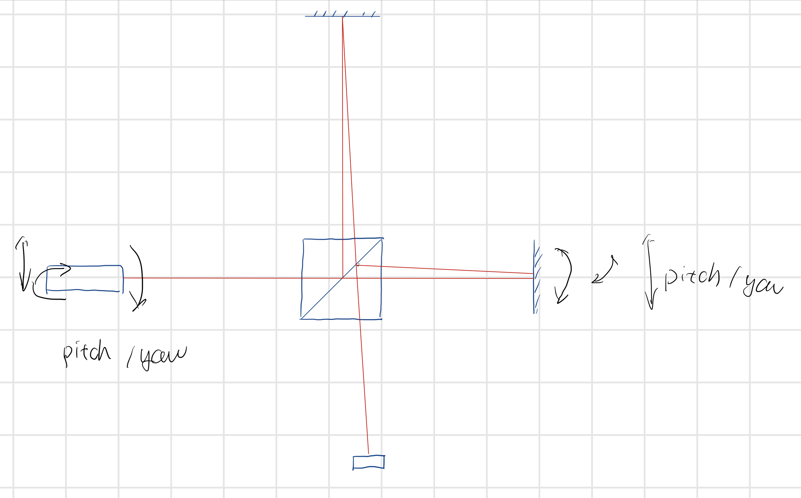

# Length Measurement with Direction (Optical Ruler) 

# Introduction

The positioning of certain engineering systems is required to very great accuracy, notably in the semiconductor industry where wafers must be moved to known positions to **sub-micron precision**. In principle, optics should be able to provide position information to within **a fraction of a wavelength of light**.

It is possible to construct such systems interferometrically. Simplistically, one can conceive of a **Michelson interferometer** with one mirror attached to the moving object and a second acting as a reference; and a distance moved would translate into a **number of fringes** that could be **counted electronically**.

An alternative approach, an **encoder**, works as you yourself would by **reading the marks on a scale or ruler**. In either case the trick is to be able to deduce the **direction** as well as **magnitude** of the movement and for this you might need two interference patterns or scales in parallel.

 Many commercial systems (for instance as used in the Moller-Wedel experiment) use this second sort of method and can do so very accurately over large distances. 

# Aim
To produce an optical system capable of detecting **motions** over **a few cm** and giving **directional** as well as **distance** information. The system must be insensitive to tilts of the moving object, and to **beam divergence** over the operating distance.

Limitations in terms of signal to noise ratio, maximum distance of operation, etc. must be determined.

**What does insensitive to tilt mean?**

# Possible Solutiuon

## Michelson Interferometer 

The structure of the Michelson interferometer is relative simple, consisted of the laser source, a beam splitter ,one mirror attached on the moving object, one reference mirror and the detector.

<text>Figure 1. Basic Structure of Michealson Interferometer</text>

   
### Laser Source

AS for the laser source, considering the **length of coherent**, it is of necessity to use a single mode laser source. The wavelength of the laser source should also be put into consideration due it infect the size of the fringes. Longer wavelength meaning larger spacing between the fringes.

$$d = \frac{\lambda}{2}$$

The heat sink of the laser should also be put into consideration.

The potential laser sources: He-Ne laser source, semiconductor laser source.

### Light Splitter 

The silver-coated light splitter should have a split ratio of 50:50.

### Optical Device Holder
The holder of the optical device should enable the optical have a few degrees of freedom(Yaw, Pitch, Roll, X, Y, Z).

### Camera  

There are few parameters of the camera that we should consider. 

* Frame Fresh Rate
* Resolution
* Shutter Speed
* Wavelength Sensitive
* Bit in Pixel

### Software

One of the most important parts in this project is the fringes recgnition software. 

First of all, is how to deal with image transmitted from the camera. Embedded system or sdk on PC?

The algorithm is not hard for me (XD), this can be easily solved.

## Optical Encoder

We are not sure whether the encoder refered in the introduction is the same as the picture shown below.

<text>Figure 2. Two Types of Optical Encoder</text>

